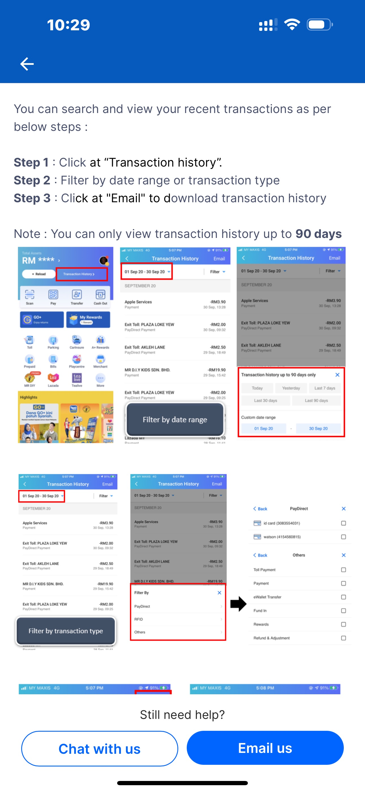
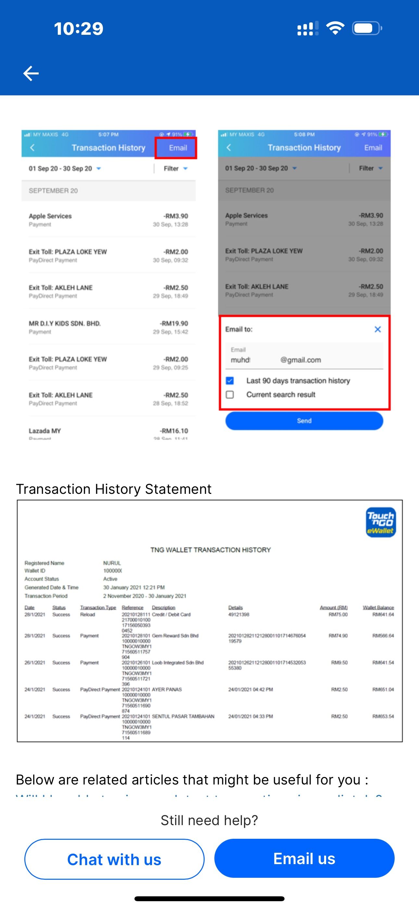
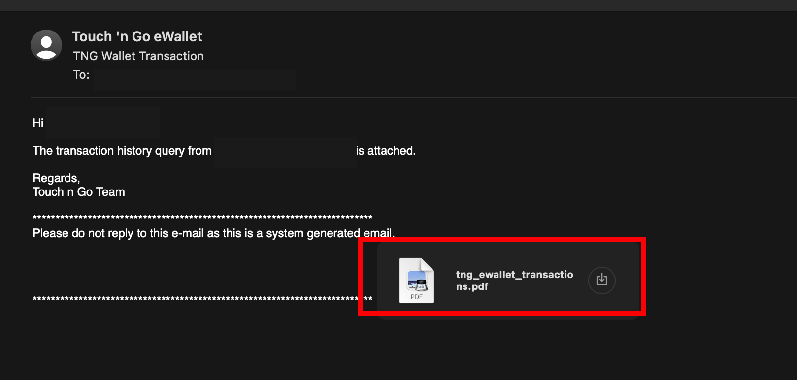

# TNG Statement in CSV
This code builds a CSV table that records all transactions within TNG e-Wallet from its statement.

- [How to download TNG Ewallet Statement](#how-to-download-tng-ewallet-statement)
- [Usage](#usage)
  - [Clone Repo](#usage)
  - [Managing virtual environment](#virtual-env-mgmt)
  - [Dependencies](#dependencies)
  - [Run Python & Get your CSV](#run-python)
- [Troubleshoot](#troubleshoot)
  - [Reversing Entries](#reversing)
  - [Money Packets 2023 Balance](#mp-balance)
  - [Missing Direct Credit Entries](#dc-entries)

## How to download TNG Ewallet Statement

> Do not go to [Touch'n Go Web Portal](https://tngportal.touchngo.com.my/#login), it's unrelated to TNG Ewallet

Here're the [official instruction](https://support.tngdigital.com.my/hc/en-my/articles/360035649754-How-can-I-view-or-download-my-transaction-history) provided by Touch'n Go in TNG eWallet app. 

<kbd></kbd>
<kbd></kbd>

The instruction above is little bit outdated, a newer flow as of writing time is like:
- go to your "Transactions" in TNG eWallet app
- Click "View All", just need to go to the Transaction History page
- Check top right corner, click "Email"
- You have the option to choose to email Last 90 days transaction history or current search result
- Submit

After wait for awhile you should receive an email from Touch'n Go as shown below:



Download the attached PDF, make sure its name is **tng_ewallet_transactions.pdf**, and put this file into `data/` folder of this project.


## Usage
1. Clone this repo to your local.
    ```
    git clone https://github.com/Rexpert/TNG_Statement_in_CSV.git
    ```

<a id="virtual-env-mgmt"></a>

2. It is recommended to setup virtual environment before installing the dependencies. You may choose either `venv` or `conda` to manage your virtual environment

    <details open>
      <summary>
        Managing virtual environment using venv
      </summary>
      <br>
      
      This guide will help you create a Python virtual environment using `venv` and install dependencies from a `requirements.txt` file.
      
      First, You need to install [Python 3](https://www.python.org/)

      To create a virtual environment:

      ```bash
      # Create a virtual environment (you can name it '.venv' or something else)
      python -m venv .venv
      ```

      Then, activate the virtual environment.


      ```bash
      # On Windows:
      .\.venv\Scripts\activate

      # On macOS/Linux:
      source .venv/bin/activate
      ```

      Once your virtual environment is activated, install the dependencies listed in `requirements.txt` by running:

      ```bash
      # Installing required dependencies
      pip install -r requirements.txt
      ```
      
      Alternatively you may install the package manually using the method mentioned in [3. Dependencies](#dependencies)

      When you’re done working, you can deactivate the virtual environment by running:

      ```bash
      deactivate
      ```

      This will deactivate the current environment and return you to your system’s default Python environment.
    </details>
    
    ---
    
    <details>
      <summary>
        Managing virtual environment using conda
      </summary>
      <br>
      
      Download & install miniconda from the [official website](https://docs.anaconda.com/miniconda/miniconda-install/) 
      
      To create a new conda environment (cloning the `base`):
      ```bash
      # # Create a conda environment (you can name it 'tng' or something else)
      conda create -n tng --clone base
      ```
      
      To switch over the `tng` environment
      ```bash
      # Activating 'tng' environment
      conda activate tng
      ```
      
      Once your conda environment is activated, install the dependencies listed in requirements.txt by running:
      ```bash
      # Installing required dependencies
      pip install -r requirements.txt
      ```
      
      Alternatively you may install the package manually using the method mentioned in [3. Dependencies](#dependencies)
      
      To leave the `tng` environment
      ```bash
      # Deactivating 'tng' environment
      conda deactivate tng
      ```
      
    </details>

<a id="dependencies"></a>

3. Dependencies

    Recommended setup

    | Installation    | Version   | 
    | --------------- | :-------: |
    | `python`        | 3.9.12    |
    | `camelot-py`    | 0.10.1    |
    | `pandas`        | 1.4.3     |
    | `numpy`         | 1.26.4    |
    | `matplotlib`    | 3.5.2     |
    | `opencv-python` | 4.10.0.84 |
    | `PyPDF2`        | 2.12.1    |

    <details>
      <summary>
        camelot-py: to read PDF statement
      </summary>

      - Installation via `pip`
        ```
        pip install camelot-py==0.10.1
        ```
      - or if you're using conda environment
        ```
        conda install -c conda-forge camelot-py==0.10.1
        ```
      - you will need to install its dependencies ([TkInter](https://wiki.python.org/moin/TkInter) & [Ghostscript](https://www.ghostscript.com/)) before using, please refer installation step in the [Manual](https://camelot-py.readthedocs.io/en/master/user/install-deps.html)
      - Detail installation please refer to `camelot-py` [Documentation](https://camelot-py.readthedocs.io/en/master/) 
    </details>
    <details>
      <summary>
        pandas: data manipulation
      </summary>

      - Installation via `pip`
        ```
        pip install pandas==1.4.3
        ```
      - or if you're using conda environment
        ```
        conda install -c conda-forge pandas==1.4.3
        ```
      - Detail installation please refer to `pandas` [Documentation](https://pandas.pydata.org/docs/index.html) 
    </details>
    <details>
      <summary>
        Numpy: Handle binary incompatibility for camelot
      </summary>

      - Installation via `pip`
        ```
        pip install numpy==1.26.4
        ```
      - or if you're using conda environment
        ```
        conda install -c conda-forge numpy==1.26.4
        ```
      - Detail installation please refer to `numpy` [Documentation](https://numpy.org/install/) 
    </details>
    <details>
      <summary>
        matplotlib: page visualization (Optional)
      </summary>

      - Installation via `pip`
        ```
        pip install matplotlib==3.5.2
        ```
      - or if you're using conda environment
        ```
        conda install -c conda-forge matplotlib==3.5.2
        ```
      - [Visual Debug](https://camelot-py.readthedocs.io/en/master/user/advanced.html#visual-debugging) on table generation
      - Detail installation please refer to `matplotlib` [Documentation](https://matplotlib.org/) 
    </details>
    <details>
      <summary>
        opencv-python: Handle missing / no module named cv2
      </summary>

      - Installation via `pip`
        ```
        pip install opencv-python==4.10.0.84
        ```
      - or if you're using conda environment
        ```
        conda install -c conda-forge opencv==4.10.084
        ```
    </details>
    <details>
      <summary>
        PyPDF2: Handle `PdfFileReader` deprecation
      </summary>

      - Installation via `pip`
        ```
        pip install PyPDF2==2.12.1
        ```
      - or if you're using conda environment
        ```
        conda install -c conda-forge PyPDF2==2.12.1
        ```
    </details>

<a id="run-python"></a>

4. Download your TNG statement (which is named `tng_ewallet_transactions.pdf`) and locating it into a `data/` folder

5. Run the [main.py](main.py)
    ```
    python main.py
    ```

6. Get your transaction table named `tng_ewallet_transactions.csv` in `output/` folder.

## Troubleshoot
Some known bugs happen during the generation of the pdf transaction report by TNG, but the only thing we can do is to manually make correction on the data:  
<a id="reversing"></a>
1. Reverse Entry (Found on [c5156d7](https://github.com/Rexpert/TNG_Statement_in_CSV/commit/c5156d7ae697589971cae36ef3f54497dd2d3ce5))  
   - The latest transaction recorded before an older transaction. 
   - This usually happens during the [Quick Reload Payment](https://support.tngdigital.com.my/hc/en-my/articles/36447357669017-What-is-Quick-Reload-Payment) via Go+. In this scenario, the payment is recorded first, then the reload occurs after.
   - I have implemented an autofix in the code to address this.
   - Example:
     
<a id="mp-balance"></a>
2. Money Packet Balance (Found on [8fe26a5](https://github.com/Rexpert/TNG_Statement_in_CSV/commit/8fe26a5b2e9884737b0a6bda975054a0f44aaaea))
   - The wallet balance of the money packet entries unexpectedly equals the amount of money packet received.
   - This is happened in the CNY 2023 when the [Money Packet Campaign](https://www.touchngo.com.my/faq/snatch-ang-pow-campaign/) took place.
   - I have implemented an autofix in the code to address this.
   - Example:
     
<a id="dc-entries"></a>
3. Missing Direct Credit entry (Found on [362cc8a](https://github.com/Rexpert/TNG_Statement_in_CSV/commit/362cc8a1362859e0be5d71780b8c2a10ddb62527))
   - Direct Credit entries are not recorded in the transaction history
   - Some of us might be involved in the Weekly Check-in on the A+ reward. The check-in for `9 Sept 2023`, `10 Sept 2023` and `12 Sept 2023` rewards free credits, but the transactions are not recorded in the pdf. However, they can be viewed in the TNG e-Wallet app's history.
   - You need to input those transactions manually if you were involved in those rewards, otherwise the `ValueError: Some Entry Not Recorded Properly` will be raised.
   - Example:
     

4. Other Unknown Bugs
   - Any uncaught bug will raise `ValueError: Some Entry Not Recorded Properly` and exit the code unexpectedly. Please open an issue and attach/screenshot the relevant transaction history pdf if found such case. 

## Disclaimer
1. I don't work in [Touch 'n Go](https://www.touchngo.com.my/) company, and hence do not represent Touch 'n Go.
2. This repository is my work to ease myself in analyzing my own expenses in Touch 'n Go e-Wallet. But you can freely use it and welcome to contribute, you are helping me to make this code more meaningful.
3. Please consider use this code in your own responsibility, although it is not harmful at all.

MIT [@Rexpert](https://github.com/Rexpert) 2022 - 2024
